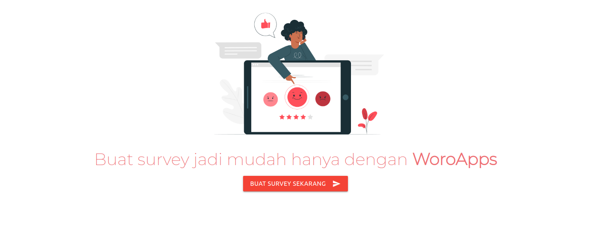

# WoroApps - Buat survey jadi lebih mudah



[](#)
[](https://github.com/Maxxoto/WoroFrontend/blob/master/LICENSE)

[Visit Website](https://woroapps.vercel.app/)

## Installation

Open your terminal and type in

```sh
$ git clone https://github.com/Maxxoto/WoroFrontend.git
$ cd WoroFrontend-Master
$ yarn start
```

## Stack

[](https://reactjs.org/)&nbsp;
[](https://redux.js.org/)&nbsp;
[](https://expressjs.com/)&nbsp;
[](https://stripe.com/)&nbsp;
[](https://sendgrid.com/)

## Support

If you have questions, feature requests or a bug you want to report, please click [here](https://github.com/Maxxoto/WoroFrontend/issues) to file an issue.

or

Like my personal project ? Feel free to use for study and buy me a coffee to keep me awake at night :smiley:.

<div>
<a href="https://www.buymeacoffee.com/nd5r9SV4N" target="_blank"></a>

or

<a href="https://trakteer.id/maxxoto" target="_blank"> Trakteer </a>

</div>

## License

Copyright (c) 2020 Maxxoto.

Usage is provided under the MIT License. See [LICENSE](https://github.com/Maxxoto/WoroFrontend/blob/master/LICENSE) for the full details.
